import Tabs from '@theme/Tabs';
import TabItem from '@theme/TabItem';

# CIT Run Assignment

This guide covers **Steps 26–40** for managing Cash In Transit (CIT) portal assignments, filtering orders, and creating runsheets.

:::tip 
Prerequisites
Ensure you have the necessary **Dispatcher** or **Operations Manager** permissions before attempting to assign runs.
:::

---

## Phase 1: Locating & Filtering Orders

### Step 26: Access the Portal
Open the **CIT Portal** and log in with your credentials.

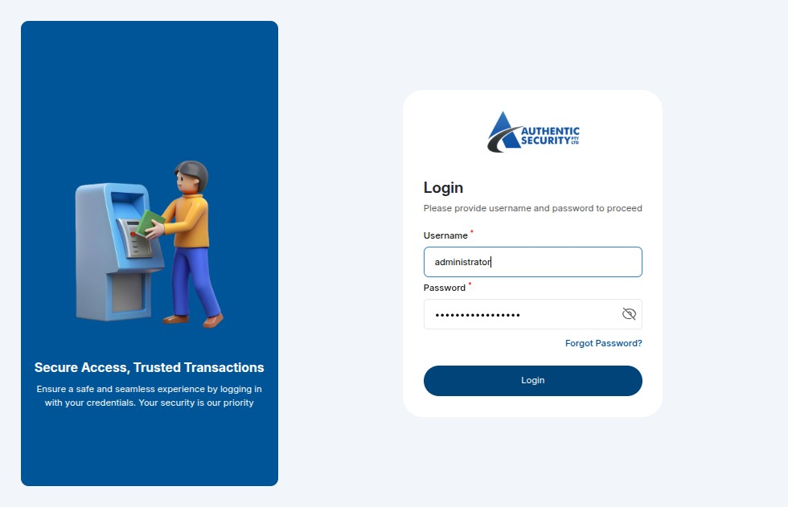

### Step 28: Navigate to Orders
From the main sidebar navigation dashboard, go to Order Management.

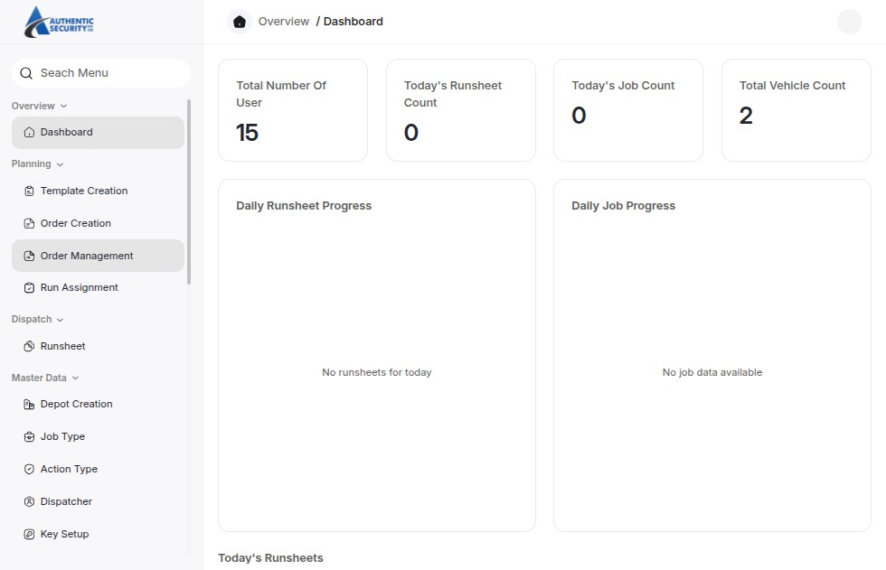

### Step 29: Check Pickup Date
Identify and note the required **Pickup Date** for the target orders.

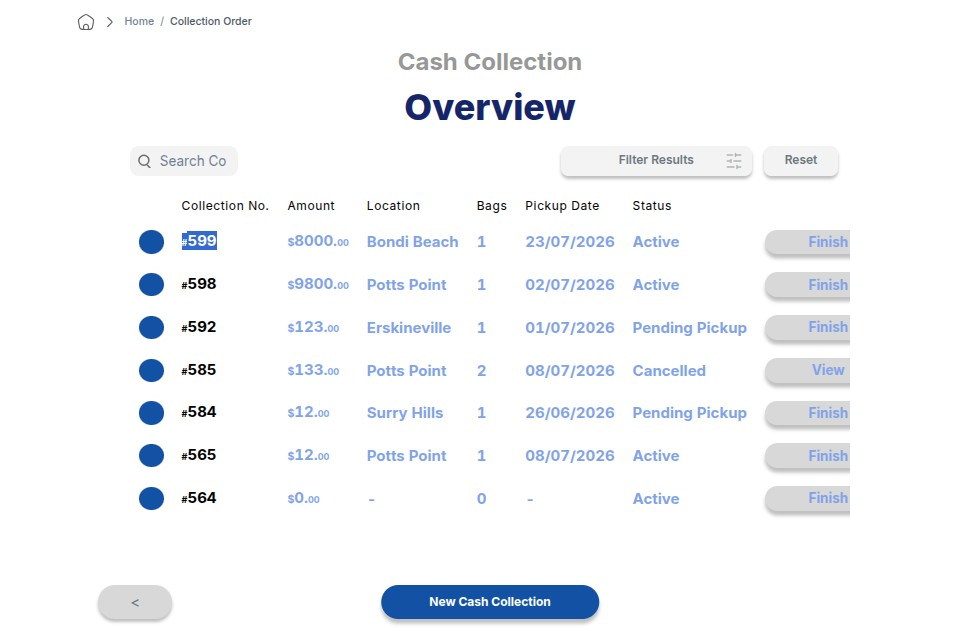

### Step 30: Apply Date Filter
Use the date picker tool to apply the relevant **Date Filter** based on your target pickup date.

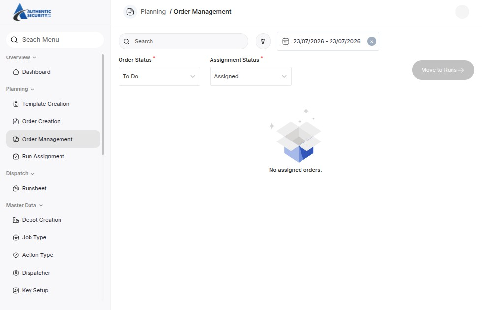

### Step 31: Filter by Status
Set the status filter dropdown to Unassigned to view orders currently waiting for a run allocation.

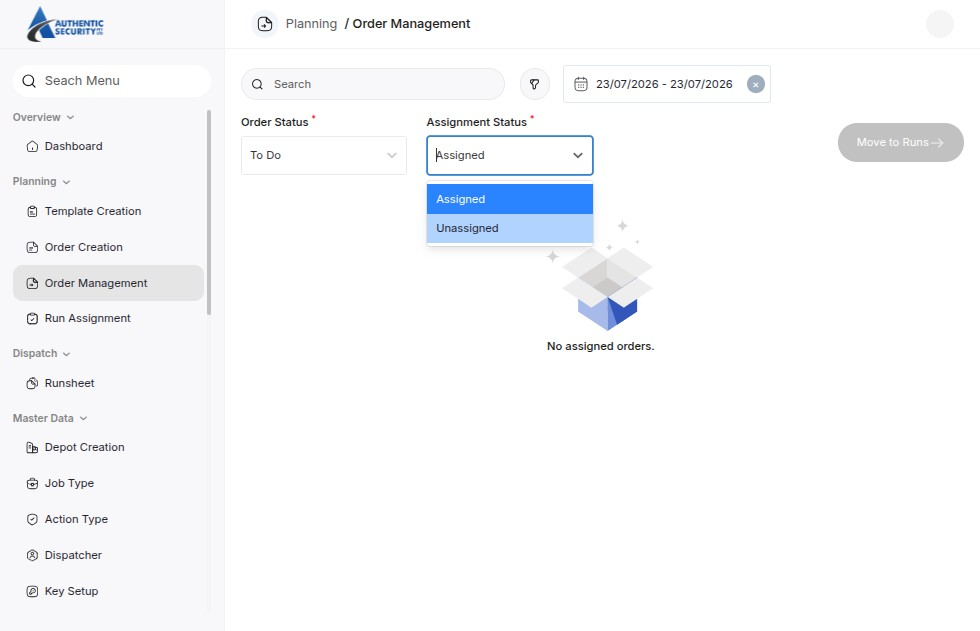

---

## Phase 2: Creating and Assigning the Run

### Step 32: Select and Move Order
Check the box next to the desired order(s) and click the **Move** button.

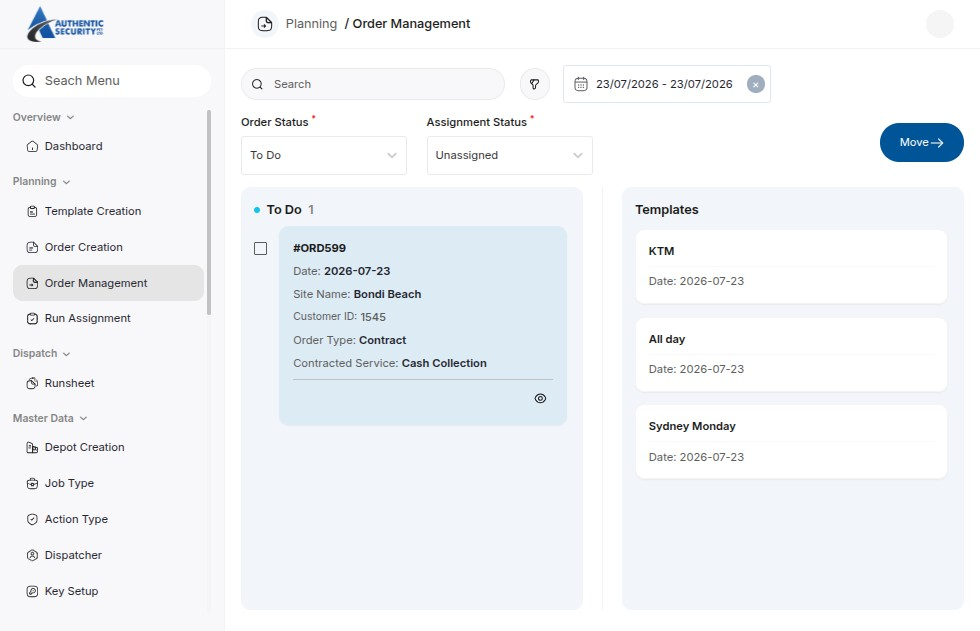

### Step 33: Allocate to a Run
From the modal prompt, choose the destination to move the selected order into an active **Run**.

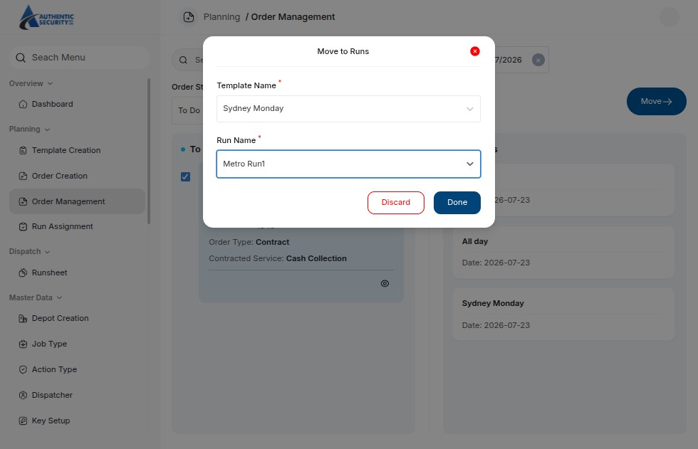

### Step 34: Open Run Assignment
Navigate to the Run Assignment tab and apply your filters to find your recently moved run.

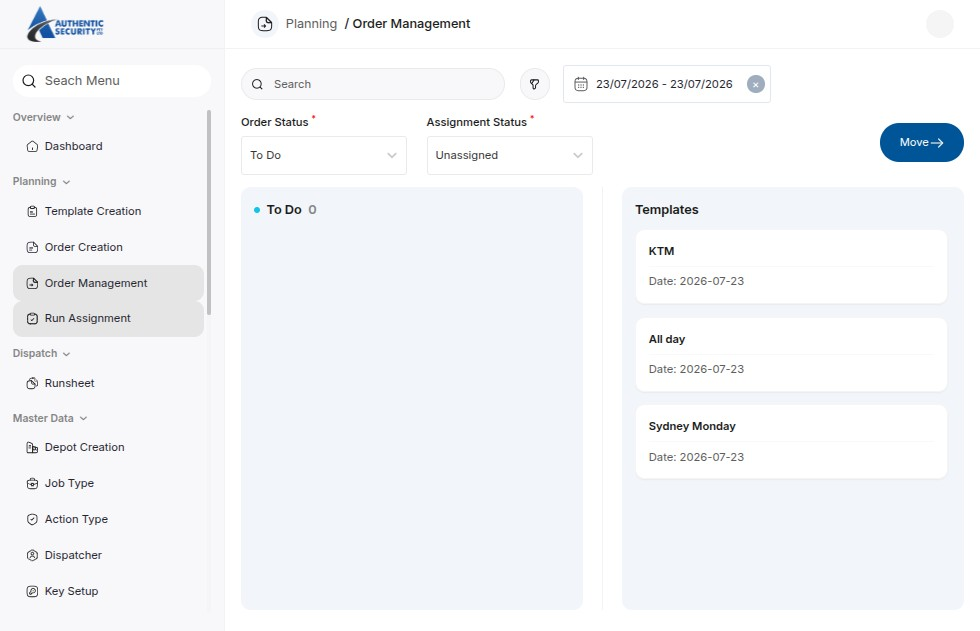

### Step 35: Select the Active Run
Locate and select the specific **Run** from the filtered list.

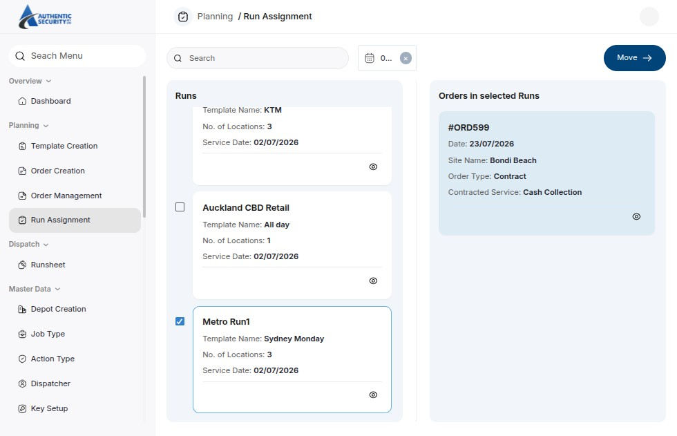

### Step 36: Assign Assets & Generate Runsheet
Assign the appropriate **User** (Driver/Guard) and **Vehicle**, then click the **Move to Runsheet** action button.

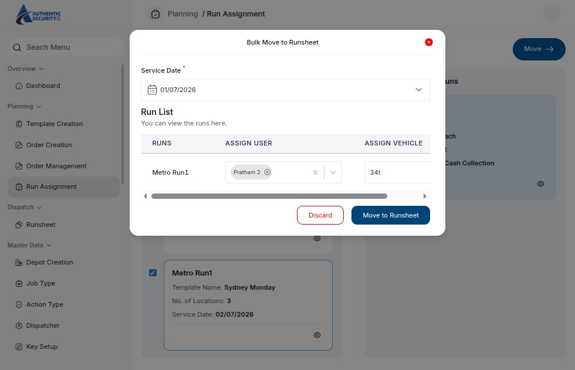

---

## Phase 3: Managing the Runsheet

:::success 
Runsheet Created Successfully
The runsheet is now live and can be accessed by field personnel or drivers assigned to the vehicle.
:::

### Step 37: Confirmation
Review the newly created **Runsheet** details on your screen to ensure asset fields are correct.

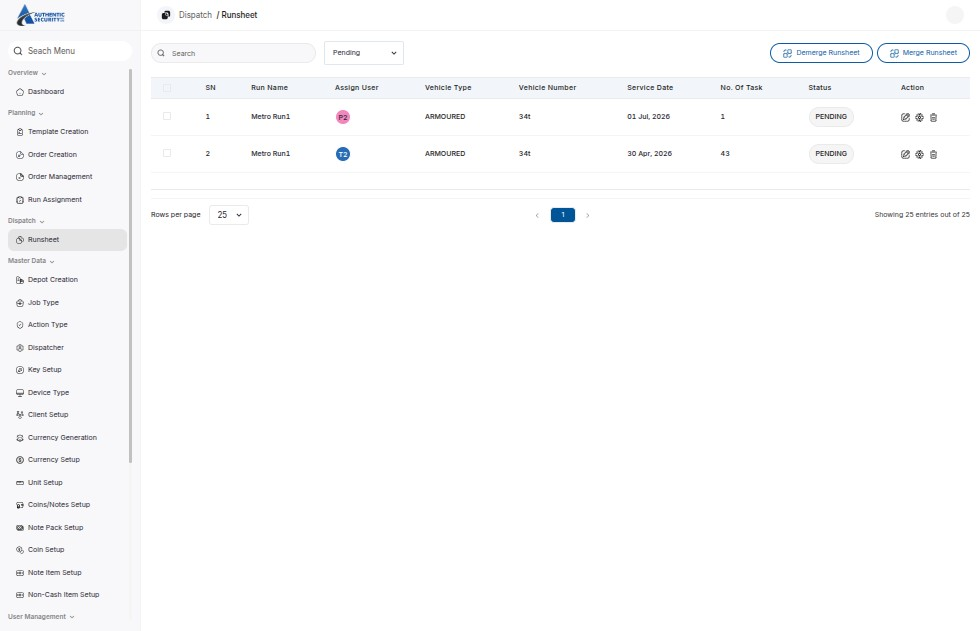

### Step 38-40: Available Management Actions

Use the interactive options below to see how to handle the active runsheet.

<Tabs>
  <TabItem value="edit" label="✏️ Edit Run (Step 39)" default>
    
Click <strong>Edit</strong> if you need to dynamically alter the assigned personnel, adjust the vehicle, or update the scheduled execution date.

    
  </TabItem>
  
  <TabItem value="status" label="👁️ View Status (Step 40)">
    
Click <strong>View Status</strong> at any time to monitor the real-time progression and individual order lifecycles within the run.

    
  </TabItem>

  <TabItem value="delete" label="🗑️ Delete Run">
    
If a run is canceled or needs a complete rebuild, use the <strong>Delete</strong> action to dissolve the runsheet and return orders back to the <em>Unassigned</em> pool.

    
  </TabItem>
</Tabs>