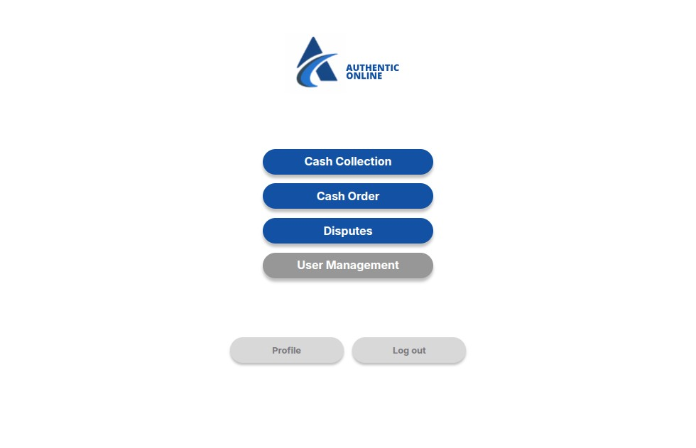
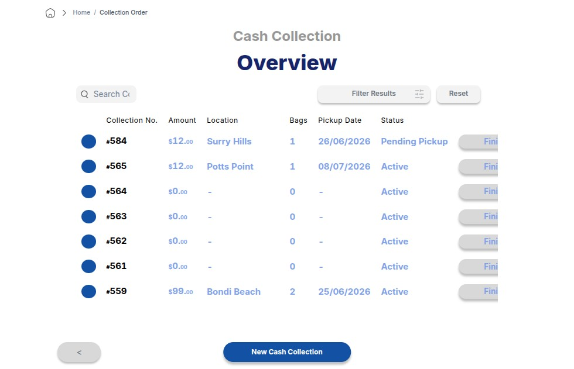
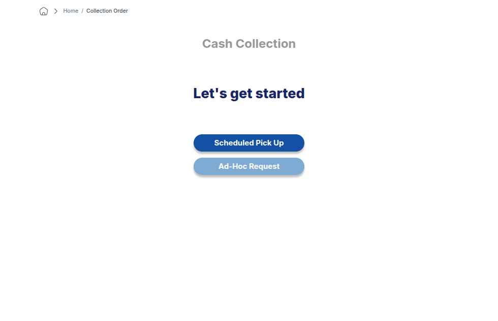
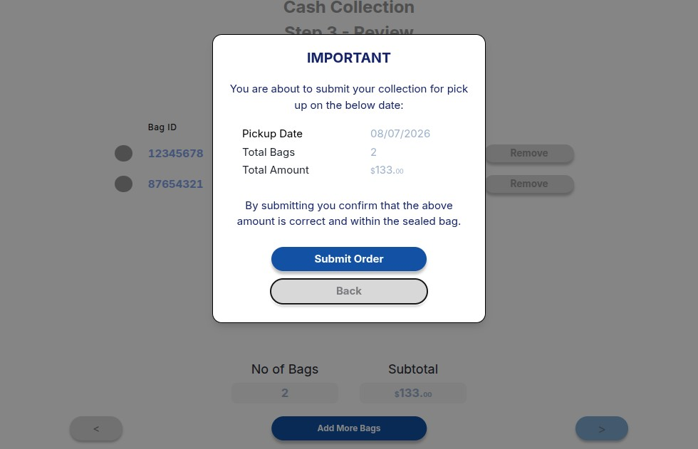
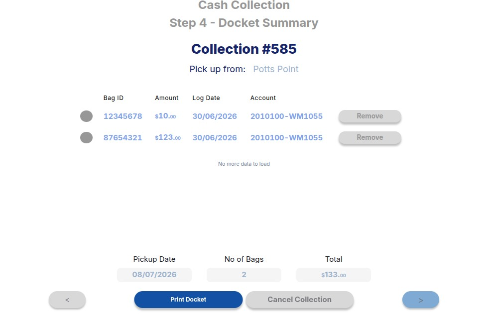
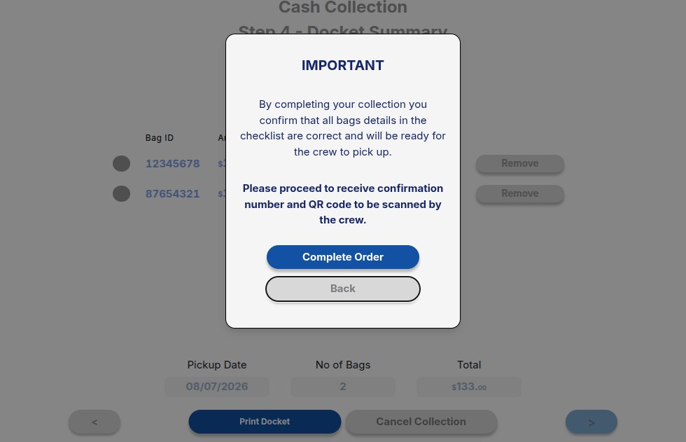
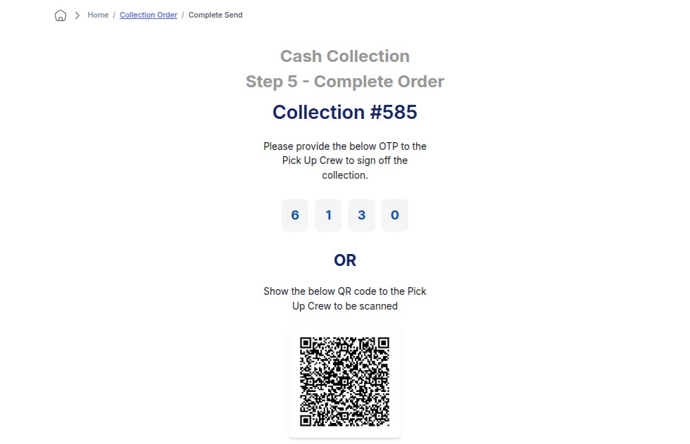
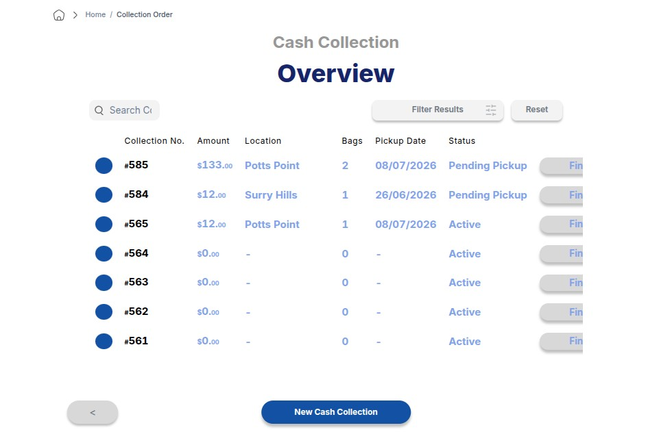

import Tabs from '@theme/Tabs';
import TabItem from '@theme/TabItem';

# Create Cash Collection

This guide covers **Steps 1–21** for creating a new cash collection order, adding bags, and finalizing the submission.

:::info 
Note
This guide demonstrates a **Scheduled Pick Up**. The workflow steps for an **Ad-Hoc** pickup are identical.
:::

---

## Phase 1: Initiating the Collection

### Step 1: Open Cash Collection
Navigate to the sidebar and open the Cash Collection module.

### Step 2: Create New Entry
Click the **New Cash Collection** button in the top right corner.

### Step 3: Select Pickup Type
Select **Scheduled Pick Up** from the options provided.

---

## Phase 2: Adding Bags to the Collection

<Tabs>
  <TabItem value="first-bag" label="🛍️ Bag 1: Primary Entry" default>
    <h3>Step 4: Enter Bag ID</h3>
    
Input the primary <strong>Bag ID</strong> barcode number and click <strong>Next</strong>.

    

    <h3>Step 5: Location Selection</h3>
    
Select the verified pickup location from the dropdown list.

    

    <h3>Step 6: Amount & Date</h3>
    
Enter the exact monetary amount and select the scheduled pickup date.

    

    <h3>Step 7: Submit Bag</h3>
    
Click <strong>Submit Bag</strong> to queue it into the order.

    

    <h3>Step 8 & 9: Confirm & Review</h3>
    
Confirm the submission pop-up and review the bag in your current list.

    
  </TabItem>
  
  <TabItem value="additional-bags" label="➕ Bag 2+: Multi-Bag Entry">
    <h3>Step 10 & 11: Add Another Bag</h3>
    
If required, click <strong>Add Another Bag</strong> and enter the next unique <strong>Bag ID</strong>.

    

    <h3>Step 12: Fixed Logistics Entry</h3>
    
Enter the amount and log date. <em>Note: The pickup date and location remain fixed to match the primary bag.</em>

    

    <h3>Step 13 & 14: Confirm Additional Submission</h3>
    
Confirm the entry to view your updated, consolidated multi-bag overview list.

    
  </TabItem>
</Tabs>

---

## Phase 3: Order Finalization & Confirmation

### Step 15: Confirm All Bags
Review the consolidated summary table and click **Confirm All Bags**.

### Step 16 & 17: Docket & Order Progress
Optionally print the collection docket for physical records, then click continue to proceed to order confirmation.

### Step 18: Complete Order
Click the **Complete Order** action button to officially submit the request to the system.

---

## Phase 4: Post-Submission Management

:::success
Order Created Successfully
The system has logged your cash collection request and assigned an active tracking state.
:::

### Step 19 & 20: View Active Order
Locate your newly created order showing an active status in the primary dashboard list.

### Step 21: Post-Submission Actions
Use the **Finish** interactive action menu to manage the order lifecycle:
* View detailed manifest logistics.
* Print physical manifests/dockets.
* Cancel the order if adjustments are required.

