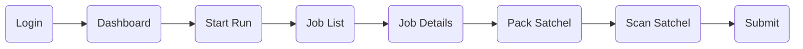

import Tabs from "@theme/Tabs";
import TabItem from "@theme/TabItem";

# Cash Collection

This guide explains how to complete a Cash Collection job using the mobile application.

## Process Overview

## 1. Login

    

        
Enter your username and password, then tap <strong>Login</strong>.

        <ul>
            <li>Enter your Username.</li>
            <li>Enter your Password.</li>
            <li>Tap <strong>Login</strong>.</li>
        </ul>
    

    

## 2. Dashboard

  
  

    

      After logging in, you will arrive at the Dashboard where today's assigned
      jobs are displayed.
    

    <ul>
      <li>View task progress.</li>
      <li>
        Tap <strong>Start</strong> to begin your run.
      </li>
      <li>Access the Job List.</li>
    </ul>
  

## 3. Scan Bags

  

    

      Tap <strong>All Bags</strong> to view your assigned jobs.
    

    <ul>
      <li>You'll see the bags assigned to you.</li>
      <li>Click the Scan All button if the bags are available.</li>
      <li>Else just click the Next option.</li>
    </ul>
  

  

## 4. All Jobs

  
  

    

      Now you'll see that the All Jobs button is enabled. This means now you can
      continue with the jobs.
    

    <ul>
      <li>
        Click on the <strong>All Jobs</strong> button.
      </li>
      <li>
        Or, Click on the card with the job information to get started with the
        job.
      </li>
    </ul>
  

## 5. Job List

  

    

      Tap <strong>All Jobs</strong> to view your assigned jobs. You can tap on
      the detail to continue with the job. There are different types of jobs but
      for now we'll see the Cash Collection.
    

    <ul>
      <li>Pending Jobs</li>
      <li>In Progress Jobs</li>
      <li>Completed Jobs</li>
      <li>Cancelled Jobs</li>
    </ul>
  

  

## 6. Job Details

  
  

    
Review the order details before beginning the collection process.

    <ul>
      <li>Verify the Order ID.</li>
      <li>Check the service address.</li>
      <li>Review customer details.</li>
      <li>
        Tap <strong>Action Required</strong> if you're unable to complete the
        job.
      </li>
    </ul>
  

## 7. Action Required

  

    

      Tap <strong>Action Required</strong> if you're unable to complete the job.
    

    <ul>
      <li>Select a Missed Service Code.</li>
      <li>Please do add a comment.</li>
      <li>Submit the details.</li>
    </ul>
  

  

## 8. Pack Collection Items

Choose one of the following methods to continue. If you have a satchel, select the first option. If you don't have a satchel, select the second option.

<Tabs>

    <TabItem value="satchel" label="Scan Satchel" default>

        ### Step 8.1 Scan Satchel

      

        

            

                Select <strong>Scan Satchel</strong> and scan the satchel barcode.
            

            <ul>
                <li>Scan the satchel barcode.</li>
                <li>Scan all assigned bags.</li>
                <li>Verify the packed bag count.</li>
            </ul>
        

    

    :::warning
    The barcodes used in the images are for testing purposes only. Please ensure you scan the correct barcodes for your satchels and bags during the collection process.
    :::

    :::info
    You can have multiple satchels for a single collection. Scan each satchel and pack the bags accordingly.
    Just make sure you scan all the bags assigned to the collection before submitting the packed satchel.
    :::

</TabItem>

<TabItem value="bags" label="Scan Bags Directly">

    ### Step 8.1 Scan Bags

    

    

        

            Select <strong>No Satchel</strong> and scan each assigned bag.
        

        <ul>
            <li>Scan every assigned bag.</li>
            <li>Ensure all bags are accepted.</li>
        </ul>
    

:::warning
If you scan the barcode of a bag that is not assigned to the collection, an error message will be displayed. Only bags assigned to the selected order can be scanned.
:::

    

</TabItem>

</Tabs>

## 7. Submit

  

    

      Verify all collection items, then tap <strong>Submit</strong> to complete
      the process.
    

  

:::tip

The Cash Collection job has been successfully completed.

:::
