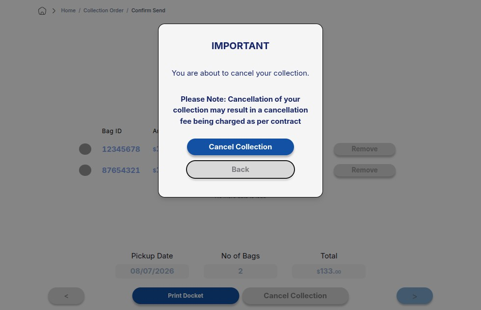
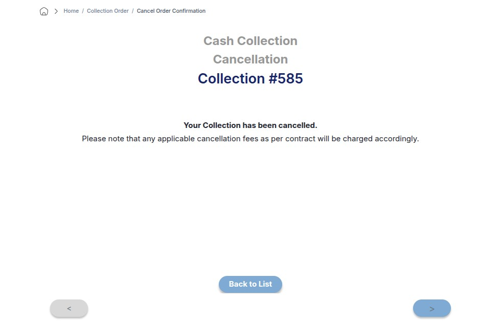

import Tabs from '@theme/Tabs';
import TabItem from '@theme/TabItem';

# Manage Cash Collection

This guide covers **Steps 22–25** for administrative management, printing documentation, and handling order cancellations within the Cash Collection dashboard.

---

## Action Paths: Print vs. Cancel

Once an order is created, you can perform immediate secondary operations from the active order panel. Select your required action below:

<Tabs>
  <TabItem value="print" label="🖨️ Option A: Print Docket (Step 22)" default>
    
To generate physical paperwork for drivers or auditing records, select the target order and click <strong>Print Docket</strong>.

    
  </TabItem>
  
  <TabItem value="cancel" label="❌ Option B: Initiate Cancellation (Step 23)">
    
If an order was created in error or needs to be voided, click the <strong>Cancel Order</strong> action button from the management dropdown.

    
  </TabItem>
</Tabs>

---

## Processing Cancellations

If you chose to cancel the order in the previous step, follow these final verification procedures to clear it from the active queue.

:::danger 
Critical Action
Canceling a cash collection order is **irreversible**. Ensure you are targeting the correct Order ID before confirming.
:::

### Step 24: Confirm Cancellation
A confirmation modal will appear. Review the warnings and click Confirm Cancellation to finalize the void request.

### Step 25: Return to Order List
After receiving the successful cancellation banner alert, the system will automatically refresh. Return to the main dashboard list to verify the order status has updated accordingly.

