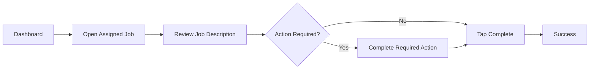

import Tabs from '@theme/Tabs';
import TabItem from '@theme/TabItem';

# Non Cash Items

:::tip
This guide explains how to complete a **Non Cash Items** job using the mobile application.
:::

## Process Overview

---

## Before You Begin

- Be logged into the mobile application.
- Ensure the assigned run has been started.
- Verify GPS and internet connectivity.

---

## Step 1 – Open the Job

Open the assigned **Non Cash Items** job from your runsheet.

### Information displayed

| Field | Description |
|-------|-------------|
| Order ID | Unique job number |
| Address | Customer location |
| Service Date | Scheduled service date |
| Job Type | Non Cash Items |
| Coordinates | GPS location |
| Total Amount | Recorded value |
| Account Owner | Customer account |
| Customer ID | Internal customer identifier |

> Review all information before proceeding.

---

## Step 2 – Complete the Job

Choose one of the available actions.

### Complete
Use **Complete** after all required work has been finished successfully.

### Action Required
Use this option if the job requires additional processing or cannot be completed normally.

:::note
Follow your company's operational procedures when selecting **Action Required**.
:::

---

## Step 3 – Success

After tapping **Complete**, the application displays a confirmation page.

Expected result:

- Job status changes to Completed
- Success confirmation appears
- Home button returns to dashboard

---

## Best Practices

- Verify customer information before completing the job.
- Confirm the correct location.
- Ensure all required actions are finished before tapping **Complete**.

---

## Troubleshooting

Job cannot be completed

Use **Action Required** and follow your operational procedures.

---

