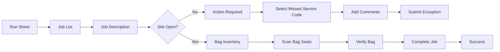

# Cash Order (Order Change)

This guide explains how to complete a **Cash Order (Order Change)** job using the mobile application, including exception handling and bag verification.

---

## Process Overview

---

# Phase 1: Job Selection and Initialization

## Step 1: View the Run Sheet

After logging into the application, the daily dashboard displays the driver's assigned tasks.

### Verify the following

- Current task progress (for example **0 / 9 Tasks**)
- Pending task cards
- Job Type
- Scheduled Date
- Customer Location

> Example: Woolworths – North Strathfield

*Run Sheet Dashboard*

---

## Step 2: Access the Job List

Tap **All Jobs** to open the complete job list.

Jobs are grouped into:

- Pending
- In Progress
- Completed

---

## Step 3: Review Job Details

Select a pending job to open the **Job Description** screen.

Verify:

- Order ID
- Total Amount
- Customer Name
- Customer ID

---

# Phase 2: Exception Management (Optional)

If the delivery cannot be completed, submit a missed service.

## Submit a Missed Service

1. Tap **Action Required**.
2. The **Add Comment** sheet opens.
3. Select the appropriate **Missed Service Code**.
4. Enter a comment describing the issue.
5. Tap **Submit**.

Example:

- **MS013 – Site Closed**
- **Comment:** Site is already closed. We'll continue tomorrow.

:::warning
Only submit a missed service when the delivery genuinely cannot be completed.
:::

---

# Phase 3: Standard Processing

## Step 1: Bag Inventory

Open the **All Bags** screen.

- Review all bags.
- If bags are not populated automatically, tap **Scan All** or **Next**.
- Grant camera permission if requested.

---

## Step 2: Scan Bag Seals

1. Align the barcode inside the scanner.
2. Scan each bag seal.
3. Continue until every bag has been scanned.

---

## Step 3: Verify Bag

After scanning:

- A confirmation message appears.
- The seal number is recorded automatically.
- Ensure every bag is verified.

Example:

> **Bag verified (1 of 1)**

---

## Step 4: Complete the Job

1. Tap **Done** or **Next**.
2. Wait for the success screen.
3. Tap **Home** to return to the dashboard.

---

## Success

The application displays:

- Green success icon
- **Job Completed**
- **Your task has been completed successfully**

:::tip 
Best Practice
Ensure every bag seal barcode matches the invoice before submitting. Mismatched seals may require supervisor approval.
:::
