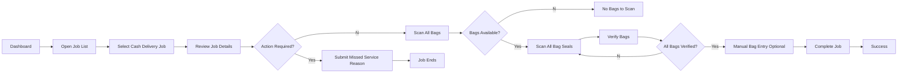

import Tabs from '@theme/Tabs';
import TabItem from '@theme/TabItem';

# Order Float

:::tip
This guide walks through the complete Order Float process, from selecting a job to verifying bags and completing the float.
:::

---

## Process Overview



---

# Step 1 — Dashboard

The Dashboard displays today's assigned tasks and allows you to begin your run.


### Information Displayed

- Remaining tasks
- Assigned jobs
- Start / End Run
- All Jobs shortcut

---

# Step 2 — Open Job List

Tap **All Jobs** to display every assigned job.


Each card displays:

- Job Type
- Order ID
- Service Date
- Customer
- Location

---

# Step 3 — Open Job Details

Select a Cash Delivery job to review its information.


## Review

Before continuing verify:

- Order ID
- Service Date
- Address
- Coordinates
- Customer ID
- Total Amount

:::info
Always verify the job details before proceeding to bag verification.
:::

---

# Step 4 — Action Required (Optional)

If the delivery cannot be completed, tap **Action Required**.


Choose:

- Missed Service Code
- Comment

Example:

```
MS013 - Site Closed
```

Add any additional notes before submitting.

:::warning
Submitting an Action Required form closes the delivery without completing bag verification.
:::

---

# Step 5 — Scan All Bags

If bags are available, tap **Next**.

The application opens the scanner.


## Scanner

The scanner displays:

- Total bags
- Remaining bags
- Scanned bags
- Expected seal numbers

Simply point the camera toward the barcode.

---

# Step 6 — Verify Bags

After scanning, every bag must be verified.


The application displays:

- Bag ID
- Order ID
- Verification status

A green check indicates the bag has been successfully verified.

You may:

- Scan individual bag
- Scan all bags
- Continue

---

# Step 7 — No Bags Available

If there are no bags assigned, the application displays:


The message shown is:

```
No bags to scan
```

In this case simply continue to the next step.

:::note
This screen is expected for deliveries that do not require sealed bags.
:::

---

# Step 8 — Manual Bag QR Entry

Some deliveries require entering or scanning the bag seal manually.


## Enter

- Bag Seal
- Amount (Optional)

The bag seal can be:

- scanned using QR
- entered manually

Use **Add Bag** if additional bags need to be recorded.

---

## Manual vs Scanner

<Tabs>

<TabItem value="camera" label="Camera Scan">

- Opens the device camera
- Scan QR code
- Bag automatically added

</TabItem>

<TabItem value="manual" label="Manual Entry">

- Enter seal number manually
- Optional amount
- Tap **Add Bag**

</TabItem>

</Tabs>

---

# Step 9 — Complete Job

After every required bag has been added:

Tap **Complete**

The application validates:

- Required bags
- Bag seals
- Amount
- Delivery information

:::success
The job cannot be completed until all required validations succeed.
:::

---

# Step 10 — Success

Once completed, the Success page appears.


The application displays:

> **Job Completed**

Return to the dashboard using **Home**.

---

# Troubleshooting

## Scanner cannot read barcode

- Clean barcode
- Increase lighting
- Hold camera steady
- Move closer
- Try manual entry

---

## Bag not found

Possible causes:

- Incorrect bag
- Wrong delivery
- Already scanned
- Invalid seal

---

## Complete button disabled

Verify:

- All bags scanned
- Required information entered
- Network available
- Validation completed

---

## Common Statuses

| Status | Meaning |
|---------|----------|
| Pending | Waiting to start |
| In Progress | Delivery has started |
| Verified | Bag successfully scanned |
| Completed | Delivery finished |
| Action Required | Delivery could not be completed |

---

# Best Practices

:::tip

- Review job details before travelling.
- Scan every bag carefully.
- Verify the green confirmation before proceeding.
- Record accurate comments when using **Action Required**.
- Double-check bag seal numbers before completing the job.
- Ensure all bags are verified before tapping **Complete**.

:::

---

# Completion Checklist

- ✅ Open assigned Order Float job
- ✅ Review job details
- ✅ Scan all assigned bags
- ✅ Verify every bag
- ✅ Manually add bags if required
- ✅ Complete order float
- ✅ Confirm success screen appears

---

Congratulations! You have successfully completed the Order Float workflow.